# My Bookish Companion

## Project Overview

My Bookish Companion is an AI-powered reading assistant built with **Google's Agent Development Kit (ADK)** that helps users tackle epic books and literary classics through structured, personalized reading plans. 

Inspired by reddit community initiatives like [r/ayearofwarandpeace](https://www.reddit.com/r/ayearofwarandpeace/), this conversational agent guides users from book discovery to receiving personalised reading schedules and engagement material, automatically generating **GitHub issues** for tracking progress.

On a technical level, a **Multi-Agent Architecture** is demonstrated. Technical features include:
- **Custom Python Orchestration**, where specialized sub-agents are orchestrated by a root agent to perform distinct tasks.
- Agent handover through a **deterministic gating workflow**.
- **Multi-turn conversational interactions** with the user.
- **Tool integrations** for data retrieval.
- **Model Context Protocol (MCP)** integration for standardized, robust tool usage.
- **Session state management** to maintain user context.
- **Artifact automation** where reading plans and engagement material are synchronized with GitHub Issues.


## User Journey


### Phase 1: Book Discovery
Users begin a conversation with the chatbot, describing their reading preferences without needing a specific title in mind. The system gathers genre, historical period, classic vs. contemporary, and reading level preferences.

Based on this input, My Bookish Companion suggests a book option, identifying the title and author (and ISBN if available), and explaining why it matches the user's criteria.

### Phase 2: Schedule Configuration
Once a book is confirmed, the system collects scheduling constraints on how much time the user can dedicate to reading per day.  

Once the schedule is set, My Bookish Companion creates a GitHub issue
containing a day-by-day breakdown of reading sessions and page ranges, providing a persistent and collaborative way to track progress.


### Phase 3: Engagement Material Generation
To keep the user motivated, My Bookish Companion creates engagement material for the first chapter of reading, 
containing a chapter summary, reflection questions and interesting facts about the author/period.

The engagement material is stored in a GitHub issue for tracking and accessibility.

## Technical Design

### Architecture Overview
The system implements a **State-Machine Multi-Agent Architecture** using a custom Python-based root agent (subclassing ADK's `BaseAgent`). This pattern provides **deterministic phase-based routing** with deep history recovery for robust state management across linear workflow stages: Discovery → Scheduling → Engagement.

#### High-Level Data Flow
*   **Step 1 (Discovery Phase)**: `BookishOrchestrator` delegates to `DiscoveryAgent`.
    *   **Completion Detection**: Agent calls `mark_task_complete('book_discovery')` tool when user confirms book choice.
    *   **Multi-Turn Support**: Agent can ask multiple clarifying questions within this phase.
*   **Step 2 (Scheduling Phase)**: `BookishOrchestrator` delegates to `SchedulingAgent`.
    *   **Completion Detection**: Agent calls `mark_task_complete('schedule_creation')` tool after creating GitHub issue.
    *   **Artifact**: Automatic **GitHub Issue** creation via **MCP Toolset**.
*   **Step 3 (Engagement Phase)**: `BookishOrchestrator` delegates to `EngagementAgent`.
    *   **Completion Detection**: Agent calls `mark_task_complete('engagement_generation')` tool after creating GitHub issue.
    *   **Artifact**: Automatic **GitHub Issue** creation for engagement materials.

```mermaid
graph LR
    User([User])

    Orch["🎯 BookishOrchestrator<br/>(Coordinator)"]

    Disc["📚 DiscoveryAgent<br/>Find the perfect book"]
    Sched["📅 SchedulingAgent<br/>Create reading plan"]
    Eng["✨ EngagementAgent<br/>Generate study material"]

    A1["Reading Schedule<br/>Issue"]
    A2["Engagement Material<br/>Issue"]

    style User fill:#ffffff,stroke:#333333,stroke-width:2px
    style Orch fill:#f3e5f5,stroke:#7b1fa2,stroke-width:2px
    style Disc fill:#e3f2fd,stroke:#0288d1,stroke-width:2px
    style Sched fill:#e8f5e9,stroke:#388e3c,stroke-width:2px
    style Eng fill:#fff3e0,stroke:#f57c00,stroke-width:2px
    style A1 fill:#ffffff,stroke:#388e3c,stroke-width:1px
    style A2 fill:#ffffff,stroke:#f57c00,stroke-width:1px

    User <--> Orch
    Orch --> Disc
    Disc --> Orch
    Orch --> Sched
    Sched --> A1
    Sched --> Orch
    Orch --> Eng
    Eng --> A2
    Eng --> Orch
```




### Key Technical Decisions

#### Choosing the Right Agent Pattern

In the Google Agent Development Kit (ADK), selecting the appropriate agent pattern is critical for balancing flexibility with deterministic reliability. Three primary patterns were evaluated:
1.  **[LlmAgent (Pure LLM)](https://google.github.io/adk-docs/agents/llm-agents/)**: Ideal for tasks requiring high reasoning and natural language processing but prone to non-deterministic behavior if used for complex orchestration.
2.  **[Workflow/Deterministic Agents](https://google.github.io/adk-docs/agents/workflow-agents/)**: While LLM-based agents rely on dynamic reasoning, Workflow agents follow structured, predefined logic. They manage execution sequences—such as sequential steps, parallel tasks, or loops—programmatically without involving an LLM in the orchestration. This approach yields highly predictable and deterministic behavior.
3.  **[Custom Root Agent (subclassing BaseAgent)](https://google.github.io/adk-docs/agents/custom-agents/#implementing-custom-logic)**: Provides full programmatic control over delegation logic, state management, and error handling.

Choosing the correct root orchestrator is vital: it defines how the system handles user interruptions, state transitions, and tool hallucinations.

##### Orchestrator Agents

Initially, a **[SequentialAgent](https://google.github.io/adk-docs/agents/workflow-agents/sequential-agents/)** was utilized to manage the flow from Discovery to Scheduling and Engagement. However, this led to **multi-turn conversation challenges**:
- **The Problem**: When a sub-agent (like `DiscoveryAgent`) needed to ask follow-up questions to clarify a user's preference, the `SequentialAgent` would often interpret any response as the completion of that stage. This caused the orchestrator to prematurely invoke the next agent in the sequence before a book had actually been identified.
- **The Solution**: A **[Custom Python Orchestrator](https://google.github.io/adk-docs/agents/custom-agents/#implementing-custom-logic)** (`BookishOrchestrator` subclassing `BaseAgent`) was implemented with **tool-based state advancement and deep history recovery for resilience against state persistence failures**. Each agent explicitly signals completion by calling the `mark_task_complete` tool, which advances the workflow phase (e.g. discovery → scheduling). The orchestrator routes based purely on the `current_phase` state variable. This provides deterministic and reliable agent handoff without ambiguity from natural language parsing, ensuring the user can have an unlimited back-and-forth with each agent until the agent explicitly signals task completion.

##### Sub-Agents

Other than the custom root agent, all worker agents are `LlmAgent` instances to preserve their natural language capabilities:
- **DiscoveryAgent**: Warmly greets users and manages the book selection dialog.
- **SchedulingAgent**: Gathers availability and calculates daily assignments for the chosen book.
- **EngagementAgent**: Generates summaries, questions, and facts for the first reading session.


#### State Management

[Session State](https://google.github.io/adk-docs/sessions/) in the ADK is handled via `ctx.session.state` (where `ctx` is an instance of `InvocationContext`). This provides a shared, persistent memory that allows agents to store and retrieve data across multiple turns and transitions. It is the primary mechanism for transferring context—such as user preferences or search results—between specialized sub-agents.

##### Key Technical Decisions:
- **Phase-Based Routing**: The orchestrator uses a `current_phase` state variable (discovery → scheduling → engagement → complete) to determine which agent to invoke. This provides simple, deterministic routing with clear debugging.
- **Tool-Based Phase Transitions**: Each specialized agent signals task completion by calling the `mark_task_complete` tool, which updates `current_phase` to advance the workflow (e.g. discovery → scheduling). The orchestrator detects phase changes by comparing state before and after agent execution to enable automatic handoffs.
- **Context Preservation**: Metadata extracted by the `DiscoveryAgent` (Title and Author) is used by the `SchedulingAgent` for calculations. ISBN is a secondary identifier. The full conversation history is preserved in session state for context continuity across agents.

#### Tools

[Tools](https://google.github.io/adk-docs/tools/creating-tools/) are Python functions that extend the capabilities of an agent. Interaction with external APIs and complex calculations are performed via these functions. Docstrings and signatures are utilized by the LLM to understand when and how tools are invoked.

##### Tool Inventory:
- **`mark_task_complete`**: Signals that the current agent has completed its task and explicitly advances the workflow phase. When called with a task name (e.g. `'book_discovery'`), it sets a completion flag and updates `current_phase` in session state (e.g. discovery → scheduling). The orchestrator detects phase changes and immediately advances to the next agent.
- **`get_today_and_tomorrow`**: Provides the current and following day's dates. This is vital for the `SchedulingAgent` to ensure reading plans always begin from the user's "tomorrow" rather than a hardcoded or guessed date.
- **`get_book_details`**: Interfaces with the **[Google Books API](https://developers.google.com/books)**. It retrieves critical metadata like total page counts, which are used as the denominator for calculating daily reading assignments.

#### Model Context Protocol (MCP) Integration

An important technical feature of this project is the integration of the **[Model Context Protocol (MCP)](https://modelcontextprotocol.io/)**. Instead of relying on custom Python code to call the GitHub REST API, the agent connects to the official **GitHub MCP Server**.

**Why MCP?**
- **Standardization**: MCP provides a universal interface for AI agents to connect to external systems. The agent doesn't need to know the specifics of the GitHub API endpoints, only the tool definitions provided by the MCP server.
- **Maintainability**: It is no longer necessary to maintain custom API wrapper code. The official MCP server handles authentication, schema validation, and API updates.
- **Extensibility**: Switching to MCP opens the door to easily adding more capabilities (like searching issues, or connecting to other services like Google Drive) simply by spinning up another MCP server, without rewriting agent logic.

In `agent.py`, the `MCPToolset` connects to the GitHub MCP server running as a subprocess (via `npx`), exposing distinct tools like `create_issue` directly to the `SchedulingAgent` and `EngagementAgent`.

#### GitHub Artifacts

Artifacts represent the end result of an agent's work—structured outputs that persist beyond the immediate conversation. While the ADK allows for various forms of persistence, this project prioritizes "external portability.":

**GitHub** is utilized as both a persistent storage backend and a zero-cost frontend. By leveraging **GitHub Issues**, reading schedules and engagement materials are rendered as Markdown, providing a tracking experience for the user without the need for hosted infrastructure.

### Challenges & Evolution

#### Challenge 1: Multi-Turn Conversation Support and Agent Transition

**Initial Problem**: When using ADK's `SequentialAgent`, the orchestrator would prematurely advance to the next agent after the first response from the current agent. This prevented multi-turn conversations where an agent could ask clarifying questions.

The core challenge: ***How does the orchestrator reliably determine when an agent has completed its task versus when it's waiting for more user input?***

**Solution Evolution**:

1. **Attempt 1: Keyword-based completion signals**
   - Approach: Agents instructed to output specific keywords like `BOOK_IDENTIFIED` or `SCHEDULE_COMPLETE` in their responses
   - Limitations: This approach was fragile and error-prone—typos or variations in agent output would break handovers. Additionally, keywords polluted the user-facing conversation with technical artifacts.

2. **Attempt 2: State key presence detection**
   - Approach: Check if `book_identified` exists in session state to determine completion
   - Limitations: ADK agents write to `output_key` on **every response**, not just on completion. This caused premature handovers after the agent's first message (e.g. greeting message), as the approach couldn't distinguish between intermediate responses and task completion.

3. **Attempt 3: Question mark heuristic**
   - Approach: Combine state key presence with natural language parsing—if agent output contains `?`, it's asking for input; otherwise, it has completed
   - Advantages: Language-agnostic, no hardcoded keywords, uses natural conversation patterns
   - Limitations:
     - **False positives**: Rhetorical questions or casual phrasing (e.g. "Exciting, right?") could appear in completion messages
     - **False negatives**: Imperative statements without question marks (e.g. "Please provide your availability") weren't detected as waiting for input
     - **Agent confusion**: Agents sometimes forgot to follow the punctuation convention
     - **Unreliable**: Relied on implicit behavior rather than explicit agent action

4. **Final Solution: Tool-based completion detection with deep history recovery**

   The solution combines two complementary mechanisms:
   - **Tool-based completion detection** (Primary): Agents explicitly signal task completion by calling `mark_task_complete`, which advances the workflow phase deterministically
   - **Deep history recovery** (Resilience): Orchestrator recovers workflow position from permanent event history when state variables are lost
   - **State-machine routing**: Orchestrator routes purely based on `current_phase` state variable (discovery → scheduling → engagement → complete)
   - **Phase transition detection**: Orchestrator compares phase before/after agent execution to enable automatic handoffs without user input

#### Tool-Based Completion Detection (Primary Mechanism)

**How It Works**: Instead of inferring completion from natural language patterns, agents take explicit programmatic action by calling the `mark_task_complete` tool. This tool updates the `current_phase` state variable, which the orchestrator uses for routing.

**Implementation**: Each specialized agent calls `mark_task_complete` at the appropriate moment:
- `DiscoveryAgent` calls `mark_task_complete('book_discovery')` when user confirms book → phase advances to 'scheduling'
- `SchedulingAgent` calls `mark_task_complete('schedule_creation')` after creating GitHub issue → phase advances to 'engagement'
- `EngagementAgent` calls `mark_task_complete('engagement_generation')` after creating GitHub issue → phase advances to 'complete'

**Advantages**: Tool calling is a core LLM capability. Agents are highly reliable at determining when to call tools based on their instructions. By framing completion as a tool-calling decision rather than a natural language output pattern, the system becomes significantly more robust:
- **Explicit and deterministic**: Agent takes deliberate action to signal completion and advance workflow
- **Observable**: Tool calls are logged and traceable in execution logs
- **Framework-native**: Leverages existing tool infrastructure
- **Self-documenting**: `mark_task_complete()` call clearly signals intent
- **Reliable**: No ambiguity from natural language parsing or punctuation
- **Maintainable**: Clear separation between agent logic and orchestration logic

**Code Example** - The `mark_task_complete` tool:

```python
def mark_task_complete(tool_context: ToolContext, task_name: str, summary: str = "") -> str:
    """
    Signals task completion and advances the workflow to the next phase.

    This tool explicitly controls the state machine by updating the current_phase,
    ensuring deterministic handoffs between agents.

    Args:
        task_name: Name of the completed task (e.g. "book_discovery", "schedule_creation", "engagement_generation")
        summary: Optional brief summary of what was accomplished

    Returns:
        Confirmation message indicating the phase transition
    """
    logger.info(f"✓ Task marked complete: {task_name} - {summary}")

    # Record task completion
    tool_context.session.state[f"{task_name}_completed"] = True

    # Determine next phase based on completed task
    current_phase = tool_context.session.state.get("current_phase", "discovery")
    next_phase = current_phase  # Default: no change

    if task_name == 'book_discovery':
        next_phase = 'scheduling'
        transition_msg = "Advancing to Scheduling."
    elif task_name == 'schedule_creation':
        next_phase = 'engagement'
        transition_msg = "Advancing to Engagement."
    elif task_name == 'engagement_generation':
        next_phase = 'complete'
        transition_msg = "Workflow Complete."
    else:
        transition_msg = "Staying in current phase."

    # Update the workflow phase
    tool_context.session.state['current_phase'] = next_phase

    return f"Task '{task_name}' marked as complete. {transition_msg}"
```

**Agent Configuration** - Agents are configured with the tool and instructed when to call it:

```python
discovery_agent = LlmAgent(
    model='gemini-2.5-flash-lite',
    name='DiscoveryAgent',
    instruction="""...

    ⚠️ MANDATORY COMPLETION REQUIREMENT ⚠️
    The MOMENT the user confirms their book choice, you MUST call:
    mark_task_complete(task_name='book_discovery', summary='Book identified: [Title] by [Author]')

    DO NOT forget to call this tool or the workflow will break.
    """,
    tools=[mark_task_complete],
    output_key="book_identified",
)
```

**Agent Handoff Flow**:

```mermaid
sequenceDiagram
    participant User
    participant Orchestrator
    participant DiscoveryAgent
    participant SchedulingAgent
    participant State as Session State

    User->>Orchestrator: "I want something funny"

    Note over Orchestrator: current_phase = 'discovery'
    Orchestrator->>DiscoveryAgent: Delegate

    DiscoveryAgent->>User: "Modern or classic humor?"
    DiscoveryAgent->>Orchestrator: Return control

    Note over Orchestrator: Phase unchanged<br/>→ Wait for user input

    User->>Orchestrator: "Modern satire"
    Orchestrator->>DiscoveryAgent: Delegate (same agent)

    DiscoveryAgent->>User: "I recommend Where'd You Go, Bernadette"
    DiscoveryAgent->>Orchestrator: Return control

    Note over Orchestrator: Phase unchanged<br/>→ Wait for user input

    User->>Orchestrator: "Yes, let's go with that!"
    Orchestrator->>DiscoveryAgent: Delegate (same agent)

    DiscoveryAgent->>State: Call mark_task_complete('book_discovery')
    State->>State: Update current_phase = 'scheduling'<br/>Set book_discovery_completed = True
    DiscoveryAgent->>Orchestrator: Return control

    Note over Orchestrator: Phase changed<br/>('discovery' → 'scheduling')<br/>→ Advance immediately

    Orchestrator->>SchedulingAgent: Delegate (automatic handoff)
    SchedulingAgent->>User: "How many minutes per day?"
```


*...workflow continues with scheduling and engagement phases...*

The diagram shows:
1. **Multi-turn conversation**: DiscoveryAgent asks clarifying questions ("Modern or classic humor?") and makes a recommendation. After each response, control returns to the orchestrator, which waits for user input before delegating back to the same agent.
2. **User confirmation**: The user explicitly confirms their book choice ("Yes, let's go with that!"), triggering the completion mechanism.
3. **Tool-based phase advancement**: DiscoveryAgent calls the `mark_task_complete('book_discovery')` tool, which updates the session state (setting `current_phase = 'scheduling'` and `book_discovery_completed = True`).
4. **Automatic handoff**: The orchestrator detects that `current_phase` changed (from 'discovery' to 'scheduling') and immediately delegates to SchedulingAgent without requiring additional user input.

**Phase Transition Detection** - The orchestrator detects when `mark_task_complete` advances the phase by comparing state before and after agent execution:

```python
# ORCHESTRATION LOOP - Loop enables automatic phase transitions within a single invocation
while loop_count < max_loops:
    loop_count += 1
    current_phase = state["current_phase"]

    # Route to the appropriate agent based on current phase
    if current_phase == "discovery":
        target_agent = discovery_agent
    elif current_phase == "scheduling":
        target_agent = scheduling_agent
    elif current_phase == "engagement":
        target_agent = engagement_agent
    elif current_phase == "complete":
        break

    # Execute the selected agent and detect phase changes
    phase_before = current_phase

    logger.info(f"Invoking: {target_agent.name}")
    async for event in target_agent.run_async(ctx):
        yield event

    # Check if the agent advanced the phase
    phase_after = state["current_phase"]

    if phase_after != phase_before:
        logger.info(f"✓ Transition Detected: {phase_before} -> {phase_after}")
        continue  # Continue loop to automatically invoke the next agent
    else:
        # Agent is waiting for user input, yield control
        logger.info(f"{target_agent.name} is waiting for user input.")
        break
```

If the phase changed, the orchestrator immediately continues the loop to invoke the next agent. If the phase remained the same, the agent is waiting for user input and the orchestrator yields control.

#### Deep History Recovery (Resilience Mechanism)

**Why It's Needed**: While session state (`ctx.session.state`) should persist across invocations via `DatabaseSessionService`, state variables like `current_phase` may occasionally be lost due to database serialization issues or timing problems. Without a recovery mechanism, the orchestrator would reset to the initial phase and lose track of progress.

**How It Works**: The ADK maintains two key data structures for each session:

1. **Session State** (`ctx.session.state`): A mutable dictionary where agents store variables like `current_phase` or `book_title`. Convenient for sharing data between agents, but may not persist reliably across invocations.

2. **Event History** (`ctx.session.events`): An immutable, append-only log of everything that happens during the session. Every agent message, tool call, and tool result is recorded as an event. This history is permanently stored and always persists across invocations.

When an agent executes, it **yields events** in real-time—each piece of output (text message, tool invocation, tool result) is emitted as it's generated. These events are simultaneously:
- Streamed to the user interface for display
- Appended to the permanent event history in the database
- Available for inspection via `ctx.session.events`

**Deep History Recovery Implementation** - When `current_phase` is missing, the orchestrator scans the permanent event history for tool completion messages:

```python
# STATE RECOVERY
# Scan event history to determine current phase if state is missing
if "current_phase" not in state:
    logger.info("[INIT] 'current_phase' missing. Scanning event history for tool outputs...")

    discovery_done = False
    scheduling_done = False
    engagement_done = False

    # Search event history for task completion markers
    for event in ctx.session.events:
        content_str = str(event.content) if hasattr(event, 'content') else ""

        if "Task 'book_discovery' marked as complete" in content_str:
            discovery_done = True
        if "Task 'schedule_creation' marked as complete" in content_str:
            scheduling_done = True
        if "Task 'engagement_generation' marked as complete" in content_str:
            engagement_done = True

    # Restore phase based on completion history (most recent phase takes precedence)
    if engagement_done:
        state["current_phase"] = "complete"
        logger.info("[RECOVERY] Found engagement completion in history. Restoring phase: complete")
    elif scheduling_done:
        state["current_phase"] = "engagement"
        logger.info("[RECOVERY] Found scheduling completion in history. Restoring phase: engagement")
    elif discovery_done:
        state["current_phase"] = "scheduling"
        logger.info("[RECOVERY] Found discovery completion in history. Restoring phase: scheduling")
    else:
        state["current_phase"] = "discovery"
        logger.info("[RECOVERY] No history found. Defaulting phase: discovery")
```

Since tool calls and their outputs are recorded as events, the orchestrator searches for specific strings (like `"Task 'book_discovery' marked as complete"`) in the event content to determine which tasks have been completed. It then reconstructs the `current_phase` based on this evidence.

This approach trades a small startup cost (iterating through the event log) for absolute reliability—even if state variables are lost, the orchestrator can always recover its position in the workflow by examining the permanent record of what actually happened.

#### Challenge 2: Agent Behaviour
Working with agents presents a different experience for developers compared to dealing with traditional deterministic code. In an agentic system, interactions are probabilistic and require careful management of LLM instructions.

##### Agent Hallucinations

In an initial version of the system, a `GreeterAgent` was utilized. The `DiscoveryAgent` erroneously began responding to the greeter and giving answers about book preferences as if it was the user itself.


##### Judgmental Tone and Presumption

During development, the `SchedulingAgent` was observed providing judgmental feedback regarding the user's available reading time. Responses were generated suggesting that the committed time was insufficient and that a "more realistic" answer should be provided.


##### Mitigations

To mitigate unwanted behaviours, specific instructions were given to enforce a supportive tone and prevent hallucinations. System prompts were adapted as follows:

- **Role Consistency**: To prevent the `DiscoveryAgent` from responding to other agents, deterministic gating logic ensures only one agent is active at a time. The `DiscoveryAgent`'s instructions were clarified: `"You are the first point of contact: start by greeting the user warmly!"`. This ensures the agent takes ownership of the initiation and stays synchronized with the user.
- **Tone Control**: To address judgmental behavior in the `SchedulingAgent`, explicit constraints were added to its system prompt: `"Be supportive. If the user only has a few minutes respect that."`.

Extreme care must be taken when writing system prompts and instructions. Precise guidance is required to control the behavior of LLM agents and ensure they remain focused on their specific tasks without exceeding their designated scope.


#### Challenge 3: Rate Limiting

The development of a multi-turn, multi-agent system increases the volume of API calls from multiple sources:

##### Gemini Model Rate Limits

While the `BookishOrchestrator` utilizes deterministic Python logic to manage transitions without making model calls itself, the sequential delegation to specialized sub-agents results in frequent model invocations. Each turn typically results in an LLM call from the active sub-agent. Furthermore, tool invocations (such as fetching book details or creating GitHub issues) multiply this volume; a single tool use often requires two LLM calls—one to decide to invoke the tool and a second to interpret the results and formulate a response.

When using the newest Gemini models on the free tier, these frequent calls initially triggered `429 RESOURCE_EXHAUSTED` errors, particularly during tool-heavy phases. To address this, **`gemini-2.5-flash-lite`** was selected. This model provides the best request-per-day (RPD) and query-per-minute (QPM) quota to support complex agentic workflows. However, even with this model, rate limit errors are frequently encountered.

##### Google Books API Rate Limits

The `get_book_details` tool queries the Google Books API to retrieve metadata such as page counts for scheduling calculations. Without authentication, the Google Books API imposes strict rate limits that can quickly be exhausted during development and testing, resulting in `429 Too Many Requests` errors.

To mitigate this issue, support for the `GOOGLE_BOOKS_API_KEY` environment variable was added. By providing an API key (obtained free from the [Google Cloud Console](https://console.cloud.google.com/apis/library/books.googleapis.com)), requests are authenticated and benefit from significantly higher rate limits. The same `GOOGLE_API_KEY` used for Gemini can be reused for the Books API if the Books API is enabled for the project.

While this key is optional, it is highly recommended for any extended testing or usage to avoid interruptions from rate limiting.

## Possible Future Features

The primary purpose of this project's development is the construction of a multi-agent system that supports multi-turn interactions with the user. The prioritization of technical learning and first-hand experience with these concepts is prioritized over the creation of a production-ready application. Consequently, the current implementation is presented as an MVP, with further possible product enhancements listed below:

- **Discovery phase**:
  - Reading history integration: Allow users to provide a list of previously read books (or connect to Goodreads/similar services) to avoid duplicate recommendations and better understand reading preferences.
  - Multi-book comparison mode: Instead of presenting a single recommendation, offer 2-3 curated options with brief comparisons (length, difficulty, themes) and let the user select their preferred choice.
  - Implementation of a mechanism to reject the recommendation given by the DiscoveryAgent and to continue the discovery dialogue.
- **Scheduling phase**:
  - Chapter-based reading schedule: The current schedule uses simple session identifiers (Day 1, Day 2, etc.) with page ranges. A more natural schedule would align reading sessions with actual chapter boundaries, displaying chapter names alongside the page ranges. This would require fetching chapter metadata from an external API (such as the [Open Library API](https://openlibrary.org/dev/docs/api)), as the Google Books API does not expose individual chapter information.
  - Integration of additional constraints for reading availability by the user, such as excluding weekends, holidays, or specific days.
  - Option to provide a completion date instead of daily reading time, allowing for the calculation of a daily reading minimum.
  - Generation of artifacts in an alternative format, such as PDF files or .ics files for calendar import.
- **Engagement phase**:
  - Implementation of a subscription model for the continuous delivery of engagement materials in alignment with the reading schedule.

## How to Run the Project

Follow these steps to set up and run the project locally:

### 1. Environment Setup

The project requires Python 3.10+ and Node.js (for MCP).

1. **Install Node.js**: Download and install from [nodejs.org](https://nodejs.org/). This is required to run the GitHub MCP server. Verify with `node -v` and `npx -v`.
2. Clone the repository to your local machine.
3. Create and activate a virtual environment:
   ```bash
   python -m venv .venv
   source .venv/bin/activate  # On macOS/Linux
   ```
3. Install the required dependencies:
   ```bash
   pip install -r requirements.txt
   ```

### 2. Authentication and Configuration

Set the following environment variables. You can export them in your terminal or store them in a `.env` file within the `agent/` directory:
- **`GOOGLE_API_KEY`**: (Required) Obtain this from Google AI Studio to access the Gemini models.
- **`GITHUB_TOKEN`**: (Required) Provide a Personal Access Token (PAT) with repository permissions to enable automated creation of GitHub Issues for reading schedules and engagement materials.
- **`GOOGLE_BOOKS_API_KEY`**: (Optional but recommended) API key for the Google Books API. Without this key, you may encounter `429 Too Many Requests` errors when fetching book metadata. Get one free at [Google Cloud Console](https://console.cloud.google.com/apis/library/books.googleapis.com). The key is the same as your `GOOGLE_API_KEY` if you enable the Books API for it.

### 3. Execution

Launch the agent using the ADK CLI. You can choose either the terminal or browser interface:

**Terminal Interface:**
Run the following command from the root directory:

```bash
adk run agent
```

**Browser Interface:**
Alternatively, run the agent in your browser:

```bash
adk web --port 8000
```
Click on the link given in the terminal to navigate to the browser interface.